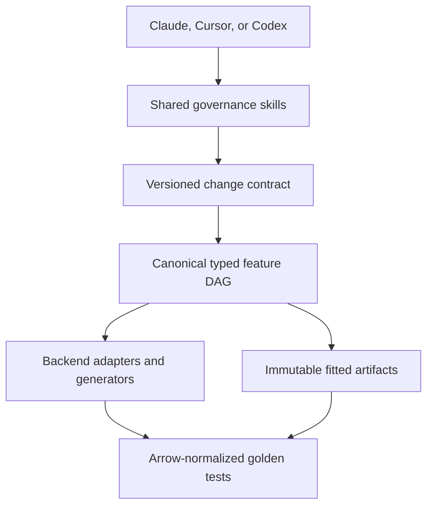

# ML Feature Governance — Claude Code, Cursor, and OpenAI Codex

This self-contained plugin makes an engine-neutral ML feature architecture an enforceable repository contract. One
shared set of skills, policies, templates, and Python validators is projected into three native plugin formats:

| Client | Native surface | Deterministic enforcement |
| --- | --- | --- |
| Claude Code | `.claude-plugin/plugin.json`, skills, agents | `hooks/hooks.json` |
| Cursor | `.cursor-plugin/plugin.json`, rules, skills, agents | `cursor/hooks.json` |
| OpenAI Codex | `.codex-plugin/plugin.json`, skills | `hooks/hooks.json` |

Initialization also adds a marked section to the repository's `AGENTS.md`, installs an always-on Cursor project rule,
and installs a project-local validator. This keeps the core workflow available in clients or execution modes where
plugin hooks or specialist agents are unavailable.

The edition has no external delivery framework, provider settings, downloads, or second project state machine.

## Architecture



`feature-platform/` owns feature meaning. Spark, SQL/dbt/Ibis, Snowflake, DuckDB, Polars, Ray, Dask, cuDF/RAPIDS,
NVTabular, Feast, and MLflow remain execution, storage, retrieval, or generated targets behind that contract.

## What it enforces

- One engine-neutral source of truth for feature semantics.
- Immutable `feature_id@version` references instead of loose column lists.
- Separate semantic type, logical/storage dtype, and model representation.
- Explicit-width and encoding-aware types such as `int32`, `uint16`, `float32`, `utf8`, and fixed-size vectors.
- Raw and transformed values as separate nodes in an acyclic DAG.
- Portable operations before backend-specific implementations.
- Stateful transforms fitted on explicit splits with separately versioned state artifacts.
- Point-in-time correctness for windows, joins, rolling aggregates, late data, and training retrieval.
- Deterministic hashing, string encoding, window boundaries, null behavior, and numeric tolerance.
- Versioned feature sets with deterministic ordering, dtypes, shapes, and cardinalities.
- Explicit backend capability/type mappings and a declared reference backend.
- Protected derived output, runtime state, client rules, and project validator files.
- Golden differential tests and reproducible run manifests.
- Versioned change contracts and explicit approval for compatibility-breaking migrations.

The complete policy is in `policies/feature-contract.md` as rules `MLFEAT-01` through `MLFEAT-14`.

## Skills

The shared workflow skills are:

```text
init
change <intent>
experiment <goal>
validate
review
architecture
```

Independent review procedures are also portable skills:

```text
review-architecture
review-portability
review-leakage
```

Claude Code exposes plugin skills with its plugin namespace. Cursor lists installed skills in Customize and supports
manual `/skill-name` invocation. Codex can select the same bundled skills automatically or by name. Specialist agent
files remain available in Claude Code and Cursor, while Codex uses the equivalent review skills.

## Requirements

- Python 3.10 or newer available as `python`.
- PyYAML 6.x for YAML contracts.
- At least one supported client: Claude Code, Cursor, or OpenAI Codex.

Install the Python dependency:

```bash
python -m pip install -r requirements.txt
```

## Local installation and testing

### Claude Code

```bash
claude plugin validate ./ml-feature-governance
claude --plugin-dir ./ml-feature-governance
```

### Cursor

Copy or symlink the package to Cursor's local plugin directory, then reload Cursor:

```bash
mkdir -p ~/.cursor/plugins/local
ln -s /absolute/path/ml-feature-governance \
  ~/.cursor/plugins/local/ml-feature-governance
```

Confirm the plugin's rule, skills, agents, and hooks in Cursor Customize.

### OpenAI Codex

The package contains a native `.codex-plugin/plugin.json`. Add its directory to a local Codex marketplace or your
organization's plugin catalog, then install and trust the bundled command hooks. The package does not change Codex model,
provider, or permission settings.

### Initialize a target repository

Invoke the `init` skill in the selected client, or run:

```bash
python /path/to/ml-feature-governance/scripts/bootstrap_project.py \
  --project-dir /path/to/project
```

The initializer is local-only. It copies missing canonical scaffold files, safely installs managed cross-client files,
preserves existing user content, validates the combined project, and records hashes in
`.feature-platform/governance.lock.json`.

## Repository-level cross-client projection

Initialization creates or updates:

| Path | Purpose |
| --- | --- |
| `AGENTS.md` managed block | Shared instructions for Codex, Cursor, and other compatible agents |
| `.cursor/rules/ml-feature-governance.mdc` | Always-on Cursor repository rule |
| `.feature-platform/tools/featurectl.py` | Stable project-local validator used by every client and CI |
| `.feature-platform/governance.lock.json` | Plugin version, clients, contract version, and managed hashes |

Only the marked ML governance block in `AGENTS.md` is replaced on reinitialization. Other repository instructions are
preserved. Managed files upgrade only when their current hash matches the previous lock; local modifications cause a
conflict instead of being overwritten.

## Native governed-change workflow

The `change` skill directs any supported client to:

1. Run `doctor` and `validate` to establish a clean baseline.
2. Inspect the canonical DAG and downstream consumers.
3. Classify the change.
4. Create a versioned contract in `feature-platform/changes/` for semantic, backend, or migration work.
5. Stop for explicit approval if compatibility is breaking.
6. Update canonical definitions before adapters and generated outputs.
7. Run validation, project tests, golden differential tests, and relevant independent review skills.
8. Record resolved versions, evidence, migration decisions, and remaining rollout actions.

This is a compact engineering protocol, not a general-purpose project-management lifecycle.

## Generated project scaffold

| Path | Purpose |
| --- | --- |
| `feature-platform/sources/` | Source schemas, timestamps, and physical locations |
| `feature-platform/entities/` | Entity and join-key contracts |
| `feature-platform/features/` | Raw and transformed feature DAG nodes |
| `feature-platform/feature_sets/` | Ordered, versioned model-input contracts |
| `feature-platform/experiments/` | Reproducible ablations and variants |
| `feature-platform/changes/` | Versioned semantic and migration decisions |
| `feature-platform/capabilities/` | Backend type and operation mappings |
| `feature-platform/schemas/` | JSON Schemas for canonical artifacts |
| `feature-platform/tests/golden/` | Cross-engine differential fixtures and policies |
| `feature-platform/generated/` | Protected derived outputs |
| `.feature-platform/state/` | Protected runtime/fitted state |

## Hooks

Claude Code and Codex use the shared `SessionStart`, `PreToolUse`, and `PostToolUse` definitions. Cursor uses the native
`sessionStart`, `preToolUse`, `postToolUse`, `afterFileEdit`, and `afterTabFileEdit` event names.

The hook scripts normalize all three payload formats, including Codex `apply_patch` commands and Cursor top-level file
edit paths. They:

- inject concise feature-governance context at session start;
- block direct edits to generated output, runtime state, the governance lock, managed validator, and managed Cursor rule;
- validate canonical YAML, JSON, or TOML after edits and return blocking feedback on violations.

Hooks are defense in depth. The repository instructions and project-local validator keep the core workflow usable when
hooks are disabled or unavailable.

## Validator coverage

Run:

```bash
python .feature-platform/tools/featurectl.py doctor --project-dir .
python .feature-platform/tools/featurectl.py validate --project-dir .
```

The validator checks identities, types, source bindings, versioned references, DAG cycles, portable transforms,
fitted-state boundaries, hashing, vectors, time windows, feature-set layout, experiments, backend capabilities, and
change-contract approval/migration records.

Static validation complements project tests that execute transforms, compare normalized outputs, verify fitted-artifact
reproducibility, and exercise real point-in-time retrieval.

## Boundaries

This plugin is not a feature store, execution engine, orchestrator, experiment tracker, or schema registry. It defines
and enforces the contract those systems consume. It never interprets approval to inspect, plan, diagnose, or review as
authorization to implement or roll out a breaking migration.

## Iceberg metadata (0.5.0)

The metadata guide is integrated with the approved interpretation: canonical definitions
remain required contracts, actual persisted schemas belong to Iceberg, and normalization
uses separate fitted DAG nodes. See `templates/project/feature-platform/docs/iceberg-metadata.md`.
Static validation checks optional `storage` bindings and experiment `dataset`/`datasets`
pins. Live catalog schema comparison and snapshot retention require adapter integration.

Re-run the initializer to install the new guide and upgrade the managed validator and
instruction blocks. Existing canonical files are preserved; merge the optional schema
properties from the packaged feature-spec schema if maintaining an older schema copy.
Existing `ml.normalization` toggles must be migrated to separate fitted nodes.
